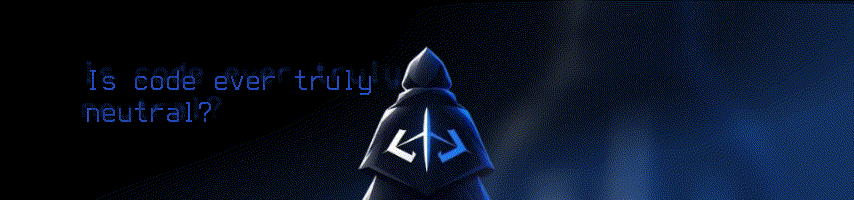

<div align="center">
    
</div>

> The Franzi'

We are a community of students passionate about **software development,
programming, open source, and technology**. Whether you're just starting to code
or already building projects, The Franzi' is a space where we can learn from
one another and turn ideas into real projects.

---
<details>
<summary><h3> 🚀 What We Do </h3></summary>

CODE BASE GG is centered around **learning by building**.
We aim to:

* 💡 Build real-world software and student projects
* 📚 Learn and share programming knowledge
* 🤝 Collaborate with fellow student developers
* 🧑‍💻 Practice professional development workflows
* 🌱 Help beginners grow their technical skills
* 🔧 Experiment with new technologies and tools
* 🌐 Contribute to open-source projects
* 🎯 Turn ideas into working applications
</details>

<details>
<summary><h3> 🛠️️ Technologies</h3></summary>

Our members work with a variety of technologies, including but not limited to:

**Languages**

* C
* C++
* Java
* JavaScript
* TypeScript
* Python

**Web Development**

* HTML
* CSS
* React
* Next.js
* Node.js

**Databases**

* PostgreSQL
* MySQL
* SQLite
* MongoDB

**Tools & Platforms**

* Git & GitHub
* VS Code
* Neovim
* Linux
* Docker

> Our technology stack is not fixed. We encourage members to explore and learn new technologies.
</details>

<details>
<summary><h3> 📂 Our Projects </h3></summary>

Projects within CODE BASE GG may include:

* 🖥️ Web applications
* 📱 Mobile applications
* ⚙️ Backend systems
* 🤖 Automation and tools
* 🎓 Academic and educational projects
* 🧪 Experimental projects
* 🌐 Open-source contributions

Each project is an opportunity to **learn, experiment, and improve**.
</details>

<details>
<summary><h3> 📌 Contribution </h3></summary>

We encourage everyone in the organization to participate.

Before contributing to a repository, please check its individual `README.md` and contribution guidelines if available.

A typical workflow may look like:

```text
Fork / Clone
     ↓
Create a Branch
     ↓
Make Your Changes
     ↓
Test Your Code
     ↓
Commit
     ↓
Open a Pull Request
     ↓
Code Review
     ↓
Merge 🎉
```

Good code is important, but **good collaboration is just as important**.
</details>

<details>
<summary><h3>👥 For Students</h3></summary>

CODE BASE GG is primarily composed of **students**, meaning our organization is designed around learning and collaboration.

Whether you're:

* 🌱 Writing your first program
* 🧑‍💻 Building your first web application
* 🔥 Working on a personal project
* 🎓 Developing an academic project
* 🚀 Interested in contributing to open source
* 🧠 Trying to learn a new technology

**You're welcome here.**
</details>

<details>
<summary><h3> 📜 Organization Guidelines </h3></summary>

As a student organization, we aim to maintain a respectful and welcoming environment.

Members are expected to:

* Respect fellow contributors
* Communicate professionally
* Give constructive feedback
* Credit others' work
* Avoid committing sensitive information
* Follow the guidelines of each repository
* Ask questions when something is unclear
</details>

---

## 🤝 Our Philosophy

### Learn. Build. Collaborate. Grow.

We believe that programming is best learned by **actually building things**.

You don't need to be an expert to contribute. Questions are welcome, mistakes are part of the process, and everyone has something they can teach others.

> **Code is better when we build it together.**

---

## 🎯 Our Goal

Our goal is simple:

> **Create a community where students can turn their ideas into code and their code into experience.**

We want CODE BASE GG to be more than just a GitHub organization. We want it to be a place where students can **learn together, build together, and prepare for the real world of software development.**

---

## 💻 CODE BASE GG

**Student Developers. Collaborative Projects. Real Experience.**

⭐ Learn something.
🛠️ Build something.
🤝 Share something.
🚀 Ship something.

---

*Made by students, for students.*
